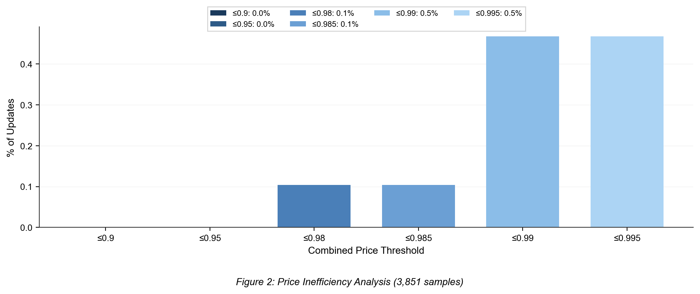
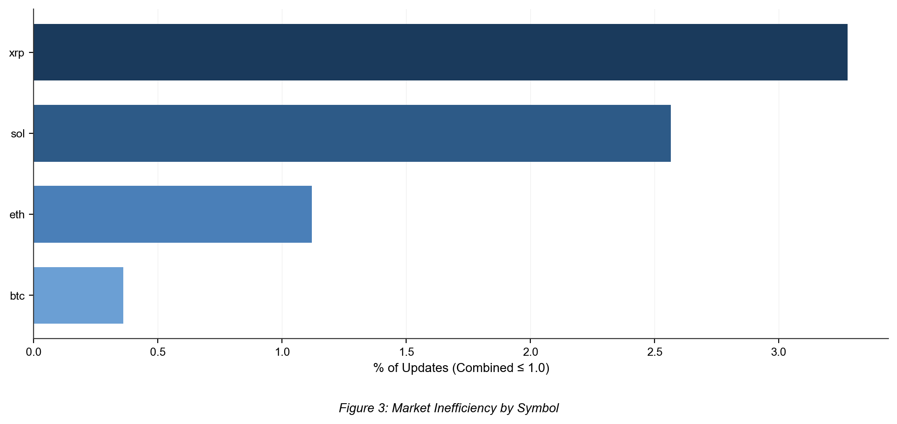
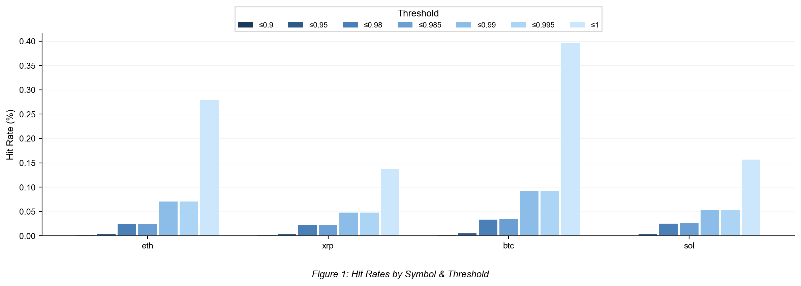
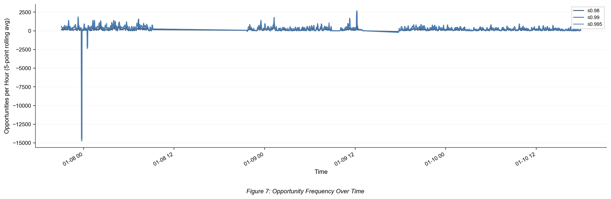

# poly-arb

[](https://github.com/SebastianBoehler/poly-arb/actions/workflows/build.yml)
[](https://github.com/SebastianBoehler/polymarket-cpp-client/actions/workflows/build.yml)

High-performance Polymarket arbitrage bot written in **C++** for low-latency trading.

## Overview

This bot monitors binary markets on Polymarket and executes arbitrage opportunities when the combined YES+NO ask price falls below $1.00. The core trading logic is implemented in **C++** for maximum performance, using the [polymarket-cpp-client](https://github.com/SebastianBoehler/polymarket-cpp-client) library for API interactions.

### Architecture

- **C++ (core)**: Order signing, WebSocket streaming, batch order placement, arbitrage detection
- **C++ discovery**: Live market scans, paper-trade projections, strategy signal JSONL
- **TypeScript (auxiliary)**: Position redemption/merging, stats collection, wallet/copy-trade research

## Strategy

### The Core Arbitrage Opportunity

In binary prediction markets, a YES token and a NO token always resolve to a combined payout of exactly **$1.00** (one of them pays $1, the other pays $0). This creates a risk-free arbitrage opportunity whenever:

```
Best Ask (YES) + Best Ask (NO) < 1.00
```

**Example:** If you can buy YES at $0.48 and NO at $0.50, you pay $0.98 total and are guaranteed to receive $1.00 when the market resolves. That's a **2% risk-free profit** (minus fees).

### Why This Works

1. **Guaranteed Payout**: One outcome MUST happen - either YES wins or NO wins
2. **Fixed Return**: The winning token always pays exactly $1.00
3. **No Directional Risk**: You don't need to predict the outcome - you profit regardless of which side wins

### Two Approaches

#### 1. Instant Arbitrage (Combined < 1.0)

When `bestAskYes + bestAskNo < 1.0`, you can immediately fill both sides and lock in profit:

```
Buy 100 YES @ $0.48 = $48.00
Buy 100 NO  @ $0.50 = $50.00
Total Cost:          $98.00
Guaranteed Payout:  $100.00
Profit:               $2.00 (2.04% ROI)
```

This is the **ideal scenario** - pure arbitrage with no execution risk if both orders fill.

#### 2. Ladder DCA Strategy (Combined ≈ 1.0)

When combined prices hover around 1.0, the bot uses dollar-cost averaging:

- **Initial entry** when combined < threshold (e.g., 1.005)
- **Add to position** on price drops (ladder levels)
- **Exponential sizing** to lower average cost faster
- **Target**: Get average combined cost below fee-adjusted payout

### Math

- **Fee-adjusted payout**: `1 - 0.02 * (1 - max_leg_price)`
- **Edge**: `payout - combined_cost`
- **Profitable** when edge > 0

### Real-World Considerations

- **Fees**: Polymarket charges ~2% on profits, reducing effective edge
- **Execution Risk**: Both sides must fill; partial fills create directional exposure
- **Liquidity**: Large orders may not fill at quoted prices
- **Speed**: These opportunities are fleeting - milliseconds matter

## Performance

The C++ implementation provides significant performance advantages for latency-critical arbitrage:

| Metric         | C++     | TypeScript | Speedup   |
| -------------- | ------- | ---------- | --------- |
| **Sign time**  | 0.06 ms | 96.8 ms    | **1613x** |
| **Total time** | 50.7 ms | 147.2 ms   | **2.9x**  |

The C++ client uses native secp256k1 cryptography and caches `neg_risk` per market to minimize API calls.

## Client Freshness

The C++ build consumes `polymarket-cpp-client` through CMake `FetchContent` with `POLYMARKET_CLIENT_GIT_TAG=main` by default. Reconfigure before latency-sensitive runs so the generated `_deps` checkout is refreshed:

```bash
bun run cpp:update-client
```

For reproducible testing, pin a ref:

```bash
POLYMARKET_CLIENT_GIT_TAG=<commit-or-tag> bun run cpp:update-client
```

## Project Structure

```
poly-arb/
├── cpp/                         # C++ trading core (main)
│   ├── src/
│   │   ├── arb_test.cpp         # Arbitrage detector with WebSocket
│   │   ├── batch_order_smoke.cpp # Batch order placement test
│   │   ├── ladder_accumulation.cpp # Ladder DCA strategy
│   │   ├── order_benchmark.cpp  # Order latency benchmarking
│   │   └── main.cpp             # Main arbitrage bot
│   └── CMakeLists.txt           # Uses polymarket-cpp-client via FetchContent
├── src/                         # TypeScript auxiliary tools
│   ├── core/                    # Shared types and utilities
│   ├── services/
│   │   └── redemption-service.ts # Position redemption/merging
│   ├── stats/
│   │   └── stats.ts             # Market stats collection
│   └── scripts/                 # Various smoke tests
├── scripts/
│   └── analyze_stats.py         # Python analysis script
├── tests/                       # Bun test suite
└── plots/                       # Generated analysis plots
```

## Requirements

### C++ (trading core)

- CMake 3.16+
- C++20 compiler (clang/gcc)
- OpenSSL, curl

### TypeScript (auxiliary tools)

- [Bun](https://bun.sh/) runtime

## Installation

```bash
git clone https://github.com/SebastianBoehler/poly-arb.git
cd poly-arb

# Build C++ executables
cd cpp
mkdir build && cd build
cmake ..
make -j8

# Install TypeScript dependencies
cd ../..
bun install
```

## Usage

### C++ Arbitrage Bot (recommended)

```bash
# Set environment variables
export PRIVATE_KEY=0x...
export FUNDER_ADDRESS=0x...

# Run arbitrage detector (monitors and places batch orders)
./cpp/build/arb_test

# Run with custom parameters
TRIGGER_COMBINED=0.995 SIZE_USDC=5 DRY_RUN=true ./cpp/build/arb_test

# Run batch order smoke test
./cpp/build/batch_order_smoke

# Run order benchmark
./cpp/build/order_benchmark

# Scan markets and emit strategy/paper-trade signals as JSONL
bun run discovery:cpp

# Crypto 15m discovery, runs until Ctrl+C/SIGTERM
./cpp/build/discovery_mode --15m --max 25 --interval-ms 1000 --out data/discovery.jsonl

# Bounded collection by wall-clock duration
./cpp/build/discovery_mode --15m --duration-hours 8 --interval-ms 30000 --out data/discovery-overnight.jsonl
```

### TypeScript Tools

```bash
# Run stats collection (market analysis)
bun run src/stats/stats.ts

# Run position redemption service
bun run src/services/redemption-service.ts

# Run tests
bun test
```

## Configuration

### C++ Environment Variables

| Variable           | Default | Description                             |
| ------------------ | ------- | --------------------------------------- |
| `PRIVATE_KEY`      | -       | Wallet private key (required)           |
| `FUNDER_ADDRESS`   | -       | Gnosis Safe address holding funds       |
| `TRIGGER_COMBINED` | 0.98    | Place orders when combined < this       |
| `MAX_COMBINED`     | 0.99    | Max combined price with slippage buffer |
| `SIZE_USDC`        | 1       | USD amount per leg                      |
| `DRY_RUN`          | true    | Set to "false" for live trading         |

## How It Works

1. **Market Discovery**: Fetches active crypto 15m markets from Gamma API
2. **WebSocket Streaming**: Subscribes to `agg_orderbook` for real-time depth
3. **Opportunity Detection**: Monitors for `bestAskYes + bestAskNo < trigger`
4. **Batch Execution**: Places YES and NO orders simultaneously via batch API
5. **FOK Orders**: Uses Fill-Or-Kill to ensure complete fills or cancellation

## Example Output

```
=== C++ Arbitrage Test ===
Size per leg: $1
Trigger combined: 0.98

[2] Finding BTC 15m market with liquidity...
    Found: btc-updown-15m-1767472200 (expires in 15min)
    Best ask YES: 0.51
    Best ask NO:  0.50
    Combined:     1.01

[3] Connecting to WebSocket for real-time orderbook...
    WebSocket connected!
    Subscribed to agg_orderbook

[4] Monitoring for arbitrage opportunity (combined < 0.98)...
    [15:46] UP: 0.51 + DOWN: 0.50 = 1.0100 (trigger: 0.9800)
    [15:41] UP: 0.48 + DOWN: 0.49 = 0.9700 (trigger: 0.9800)

    ✅ OPPORTUNITY FOUND!
    Combined: 0.97 < 0.98
    Potential profit: 3.00%

[5] Posting batch order (FOK)...
    YES order: ✓ matched (100 shares @ $0.48)
    NO order:  ✓ matched (100 shares @ $0.49)
    BOTH ORDERS FILLED!
```

## Analysis & Insights

The bot tracks market inefficiencies across crypto 15-minute prediction markets. Run the analysis script to generate visualizations:

```bash
python scripts/analyze_stats.py --csv output.csv --out-dir plots
```

### Market Inefficiency

Shows the percentage of price updates where combined YES+NO ask prices fall below various thresholds. Combined < 1.0 represents an arbitrage opportunity (before fees).



### Inefficiency by Symbol

Compares arbitrage opportunity frequency across different crypto assets.



### Hit Rates by Threshold

Detailed breakdown of hit rates per symbol across all tracked thresholds.



### Opportunity Timeline

Shows when arbitrage hits occur over time to highlight session-dependent opportunity bursts.



## Disclaimer

This is for educational purposes only. Trading on prediction markets involves risk. Do your own research before trading.

## License

[MIT](LICENSE)
